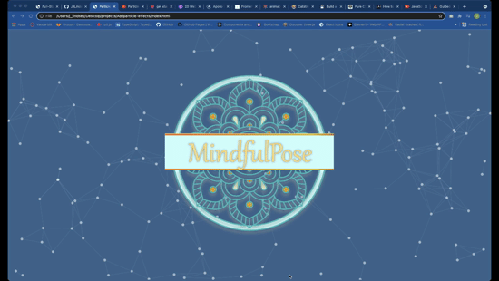

# Particles Effect p5.js

This is a tutorial using P5.JS with Brad Traversy/Traversy Media.

## Table of contents

- [Overview](#overview)
  - [Screenshot](#screenshot)
  - [Links](#links)
  - [Built with](#built-with)
  - [Useful resources](#useful-resources)
- [Author](#author)
- [Questions](#questions)

## Overview

### Screenshot

### Links

- Live Site URL: [view effect](https://jjlindsey.github.io/particle-effects/)

### Built with

- Javascript
- P5 js library

### Useful resources

- [p5.js site](https://p5js.org/) - There are some really cool examples, plus how to get started.

## Author

- Website - [Jennifer Lindsey](https://github.com/JJLindsey)
- Traversy Media - [youtube tutorial](https://www.youtube.com/watch?v=H-9jCNhLe-Qe)
- Logo - I created this logo for my yoga site.

### *Questions*
If you have any questions, reach out to me on Git Hub https://github.com/JJLindsey, or send me a message jlindsey010@gmail.com.

©Jennifer Lindsey 2021

